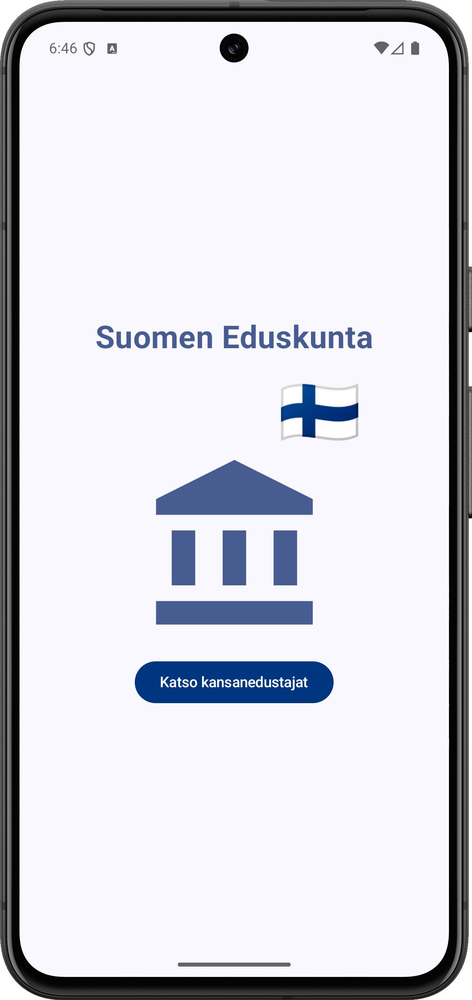
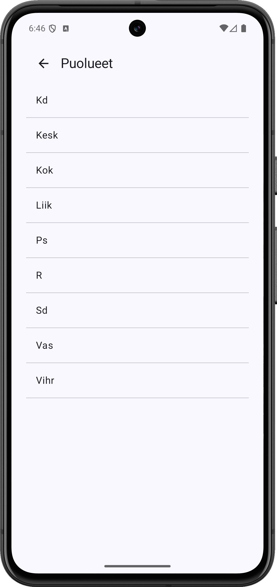
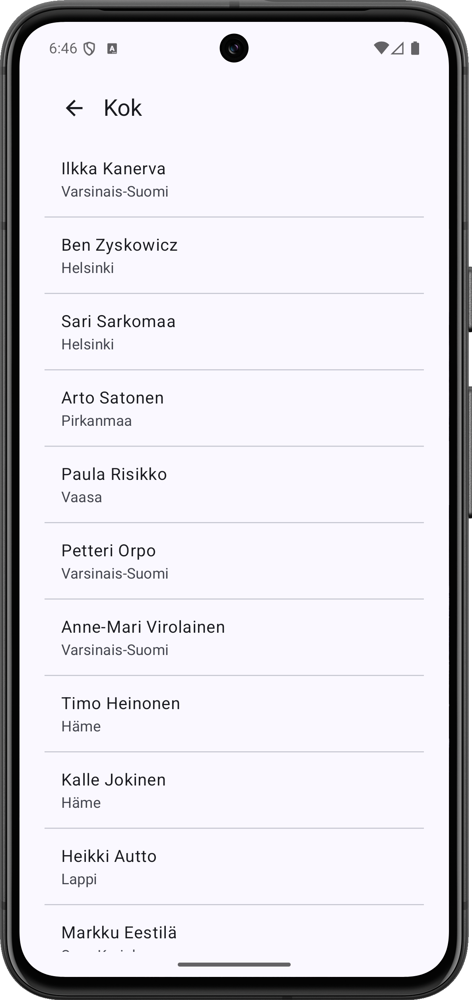
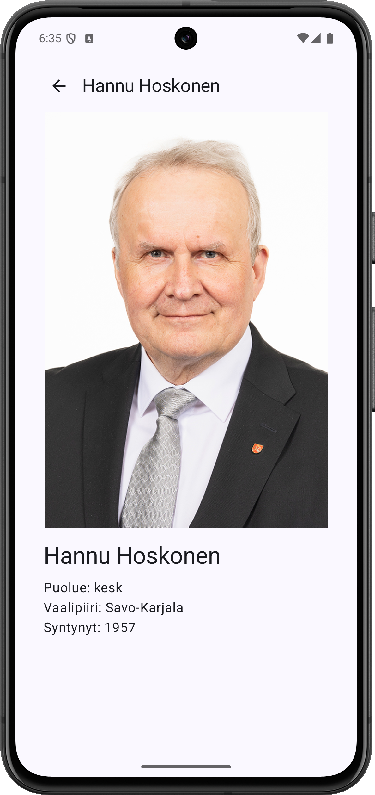
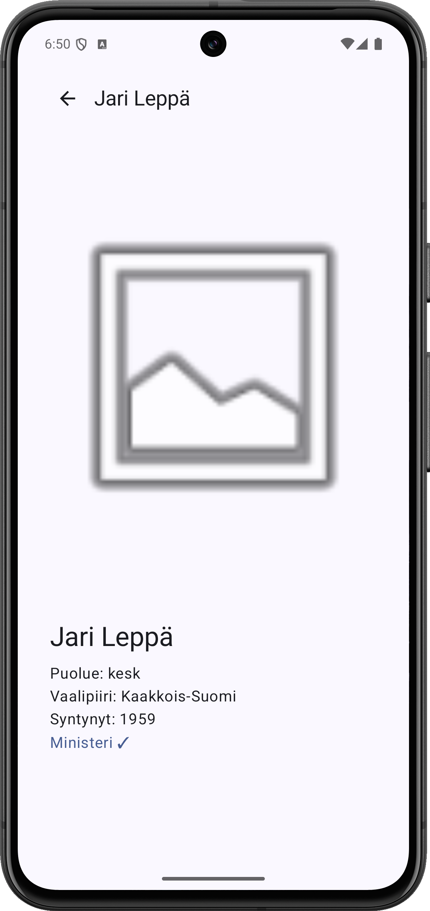

# Eduskunta App

Eduskunta App is a simple Android application that demonstrates using navigation, Retrofit, and Room in a Kotlin + Jetpack Compose project. The app shows a list of Finnish Parliament members and allows viewing their details.

## Features
- Two-level browsing: Party → Members list
- Member detail screen with photo, party, constituency, minister status, and Twitter handle
- Notes per member with +/- indicator and text
- Offline support with **Retrofit** and **Room database**
- Smooth navigation between screens using **Jetpack Compose Navigation** 
- Simple and responsive UI

## Tech Stack
-	**Kotlin**
-	**Jetpack Compose** (UI)
-	**Retrofit** (API calls)
-	**Room** (Local database)
-	**ViewModel + StateFlow** (State management)

## Screenshots

<p align="center">

</p>

<p align="center">

</p>

<p align="center">

</p>

<p align="center">

</p>

## Video link


## Android App structure:

```text
EduskuntaApp/
├─ data/
│  ├─ api/               <-- Retrofit service & EduskuntaApi
│  └─ db/                <-- Room database, Entities (MemberEntity, NoteEntity) & DAOs
├─ repositories/
│  ├─ MemberRepository   <-- interface
│  ├─ OfflineMemberRepository <-- fetches from API, caches in Room
│  ├─ NoteRepository     <-- interface
│  └─ OfflineNoteRepository  <-- saves/loads notes from Room
├─ ui/
│  ├─ screens/
│  │  ├─ MainScreen
│  │  ├─ PartyListScreen
│  │  ├─ MemberListScreen
│  │  └─ MemberDetailScreen  <-- photo, info, +/- notes
│  └─ viewmodel/
│     └─ EduskuntaViewModel  <-- StateFlow, shared across all screens
├─ EduskuntaApplication.kt          <-- Application class, initializes DB & repositories
├─ MainActivity.kt
└─ Navigation.kt         <-- all routes defined here
```

### Notes
-	The app fetches member data from a remote API using Retrofit and stores it locally in Room.
-	The UI is fully scrollable and responsive.
-	Navigation is implemented using Jetpack Compose Navigation.